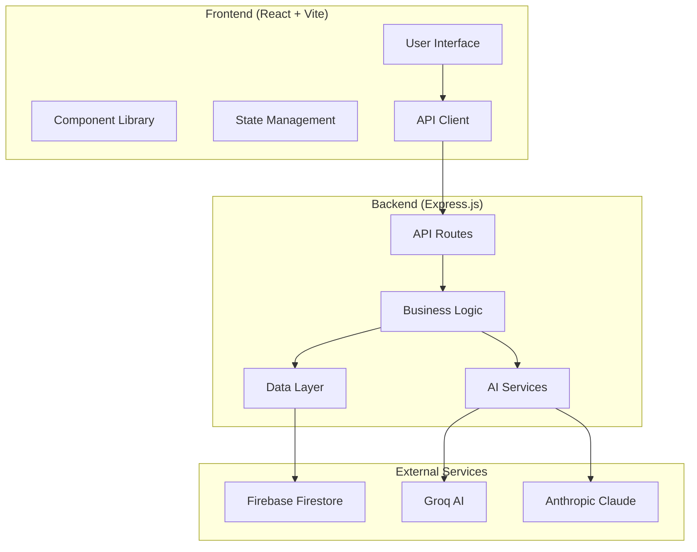
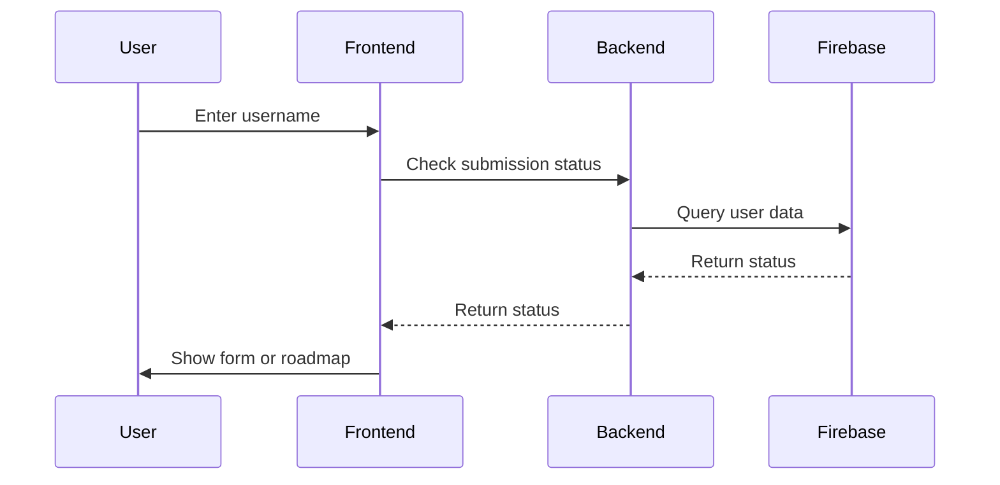
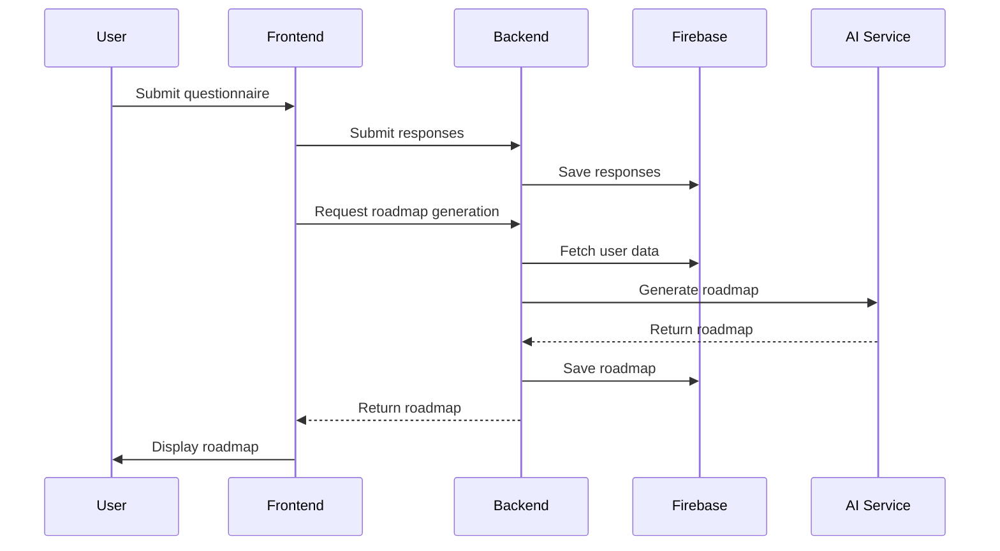
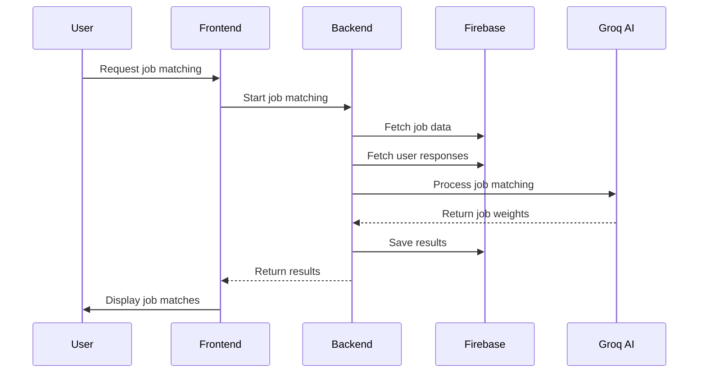

# Architecture Documentation

## System Overview

The Career Roadmap Application is a full-stack web application that generates personalized learning roadmaps for tech careers using AI-powered job matching and skills assessment.

## High-Level Architecture



## Component Architecture

### Frontend Architecture

```
src/
├── components/
│   ├── common/           # Reusable UI components
│   │   ├── Button.jsx
│   │   ├── Input.jsx
│   │   └── LoadingSpinner.jsx
│   ├── forms/            # Form-specific components
│   │   ├── FormScreen.jsx
│   │   └── SuccessScreen.jsx
│   └── roadmap/          # Roadmap-specific components
│       ├── MainContent.jsx
│       ├── WeekCard.jsx
│       └── TaskItem.jsx
├── pages/                # Page components
│   ├── LoginPage.jsx
│   ├── FormPage.jsx
│   └── RoadmapPage.jsx
├── services/             # API and external services
│   ├── api.js
│   └── firebaseService.js
├── utils/                # Utility functions
└── config/               # Configuration files
```

### Backend Architecture

```
src/
├── controllers/          # Route handlers
├── services/             # Business logic
│   ├── jobService.js
│   ├── userService.js
│   ├── roadmapService.js
│   └── groqService.js
├── middleware/           # Express middleware
│   ├── errorHandler.js
│   └── rateLimiter.js
├── routes/              # API routes
│   ├── jobs.js
│   ├── users.js
│   └── roadmap.js
├── utils/               # Utility functions
│   ├── jobUtils.js
│   └── skillUtils.js
└── config/              # Configuration
    └── firebase.js
```

## Data Flow

### 1. User Registration and Questionnaire


### 2. Roadmap Generation


### 3. Job Matching Process


## Database Schema

### Firebase Firestore Collections

#### Users Collection
```javascript
users/
├── {username}/
│   ├── answers/              # User questionnaire responses
│   │   └── {responseId}/
│   ├── responses/            # Alternative response storage
│   │   └── {responseId}/
│   ├── skillsAssessment/     # Skills assessment data
│   │   └── sortedSkillsList/
│   ├── jobMatchingSummary/   # Job matching results
│   ├── jobWeights/          # Detailed job weights
│   └── topJobs/             # Top job matches
└── Roadmap.json             # Generated roadmap data
```

#### Questions Collection
```javascript
questions/
└── all_questions/           # Questionnaire questions
```

#### Job Data Collection
```javascript
jobData/
└── {jobId}/                 # Job listings and details
```

## API Design

### RESTful Endpoints

#### Health Check
- `GET /health` - Server health status

#### User Management
- `GET /api/users/:username/submission-status` - Check user submission
- `GET /api/users/:username/roadmap` - Get user roadmap
- `GET /api/users/:username/responses` - Get user responses

#### Job Matching
- `POST /api/jobs/match` - Process job matching
- `GET /api/jobs/status/:username` - Get matching status

#### Roadmap Generation
- `POST /api/roadmap/generate` - Generate roadmap
- `GET /api/roadmap/:username` - Get roadmap

### Request/Response Format

#### Standard Response Format
```javascript
{
  "success": true,
  "data": {
    // Response data
  },
  "message": "Success message",
  "timestamp": "2024-01-01T00:00:00.000Z"
}
```

#### Error Response Format
```javascript
{
  "success": false,
  "error": {
    "message": "Error message",
    "statusCode": 400,
    "details": "Additional error details"
  },
  "timestamp": "2024-01-01T00:00:00.000Z"
}
```

## Security Architecture

### Authentication & Authorization
- Username-based authentication
- Session management via localStorage
- No sensitive data exposure

### Input Validation
- Server-side validation for all inputs
- Sanitization of user data
- Rate limiting on API endpoints

### Data Protection
- Environment variables for sensitive data
- Secure API key management
- CORS configuration
- Error handling without data exposure

## Performance Considerations

### Frontend Optimizations
- Code splitting and lazy loading
- Component memoization
- Efficient state management
- Optimized bundle size

### Backend Optimizations
- Caching for frequently accessed data
- Batch processing for AI operations
- Database query optimization
- Rate limiting and throttling

### AI Service Optimizations
- Batch processing for job matching
- Efficient prompt engineering
- Response caching where appropriate
- Error handling and fallbacks

## Scalability Considerations

### Horizontal Scaling
- Stateless backend design
- Database connection pooling
- Load balancer compatibility
- Microservices architecture potential

### Vertical Scaling
- Efficient memory usage
- CPU optimization for AI processing
- Database indexing
- Caching strategies

## Monitoring and Logging

### Application Monitoring
- Health check endpoints
- Performance metrics
- Error tracking
- User analytics

### Logging Strategy
- Structured logging format
- Error tracking and alerting
- Performance monitoring
- Security event logging

## Deployment Architecture

### Development Environment
- Local development servers
- Environment variable configuration
- Hot reloading and debugging
- Local database setup

### Production Environment
- Containerized deployment
- Environment-specific configurations
- SSL/TLS encryption
- CDN for static assets
- Database backups and monitoring

## Future Enhancements

### Planned Features
- User authentication system
- Advanced analytics dashboard
- Mobile application
- Real-time collaboration
- Advanced AI features

### Technical Improvements
- Microservices architecture
- GraphQL API
- Advanced caching
- Real-time updates
- Enhanced security
